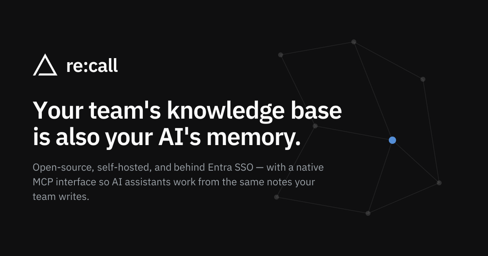

# re:call



**Your team's knowledge base is also your AI's memory.**

re:call is a shared markdown knowledge base. People write notes and connect them with
`[[wikilinks]]`. AI assistants such as Claude and Copilot read and write the same notes
over MCP, signed in as the person using them, so an assistant sees exactly what that
person is allowed to see.

It stays small on purpose: one Postgres database, one embedding call when a note
changes, and no language model running on the server. Your assistant already does the
thinking. re:call gives it something reliable to think about.

## Why

- **Every assistant remembers something different.** Your Claude knows what you told
  it; your teammate's knows something else. A shared knowledge base gives them all the
  same memory, with the same permissions as the people using them.
- **Team knowledge lives in heads and chat threads.** Notes that link to each other
  are easier to find, and easier to keep, than messages.
- **Wikis rot quietly.** A wrong runbook looks as trustworthy as a right one. re:call
  gives notes an owner and a review date, and shows each workspace what is overdue,
  broken or abandoned.

## How it works

1. **People write.** Markdown notes in shared workspaces, with links, tags and
   frontmatter. Every note has an author and a revision history.
2. **Assistants use the same notes.** About 40 MCP tools let an assistant search, read,
   write, link and organize notes. It signs in through the user's browser (OAuth), so
   there are no API keys or service accounts, and every change is recorded as that
   user's.
3. **re:call stays simple.** Search and link suggestions use keywords and embeddings;
   unlinked mentions and workspace health are plain text matching and SQL. Anything that
   needs reasoning, such as summarizing a workspace, drafting a note from a meeting or
   reviewing stale runbooks, is left to the assistant you already pay for.

## What's in it

**Writing**
- Markdown editor with live preview, `[[wikilinks]]`, tags and frontmatter properties,
  plus a reading view.
- Mermaid diagrams (flowchart, sequence, ER, gantt, mindmap and more) render in the
  editor and the reading view.
- Version history: browse, diff and restore earlier revisions.

**Finding**
- Search by meaning or by exact text from a command palette. Embeddings come from Azure
  OpenAI or any OpenAI-compatible server, including a local Ollama.
- Backlinks and a graph view show how notes connect across a workspace.
- Unlinked mentions: notes that name another note without linking to it.

**Sharing and access**
- Workspaces with Viewer, Editor and Owner roles, invitations by email, and optional
  org-wide read access.
- Sign-in with Microsoft Entra ID (for M365 organizations) or Google.

**Keeping it current**
- Notes can name an `owner` and a `review_every` interval. The workspace page lists
  overdue reviews, owners who have left, broken links, old drafts and orphans.
- An optional guide note tells people and agents what types and tags a workspace uses,
  and flags likely misspellings.
- Deletes go to a restorable trash, with optional scheduled purge.

**Getting data out**
- Export a workspace or folder as a zip of plain markdown files that open in Obsidian or
  any editor.
- Installs as an app on desktop and mobile (PWA).

## What re:call doesn't do

It doesn't run an LLM on the server: no automatic tagging, no generated answers, no
extraction pipeline. Those add cost, hide the reasoning and blur who is responsible for
a fact. When a feature is proposed, the test is whether the user's assistant could do it
with the tools re:call already has. If it could, re:call doesn't build it.

## Stack

- **Frontend:** Next.js 16 (App Router) + React 19 + shadcn/ui + Tailwind CSS v4, IBM Plex
  type, CodeMirror editing, react-markdown reading, react-force-graph-2d graph, Mermaid diagrams
- **Backend:** Python 3.12 + FastMCP — serves both REST `/api` and MCP `/mcp` from one app
- **Database:** PostgreSQL 16 + pgvector
- **Migrations:** Alembic · **Background jobs:** procrastinate
- **Embeddings:** Azure OpenAI `text-embedding-3-large` @ 1536 dims by default, or any
  OpenAI-compatible endpoint (OpenAI, Ollama, vLLM, HF TEI, LiteLLM)
- **Auth:** MSAL / Entra ID (single-tenant) or Better Auth (Google). Local dev runs a stub
  user via `AUTH_MODE=dev`.

## Quick start (local, Docker)

```bash
cp .env.example .env      # already present for local dev
docker compose up -d      # postgres + backend + worker + web
```

| Service | URL / port |
|---|---|
| Web UI | http://localhost:3000 |
| Backend health | http://localhost:8004/health |
| MCP endpoint | http://localhost:8004/mcp |
| PostgreSQL | localhost:54324 (user/pass/db: `recall`) |

Local dev defaults to `AUTH_MODE=dev` (stub user, open MCP), so nothing external is
required to start. To exercise real SSO, MCP OAuth, and embeddings, set `AUTH_MODE=entra`
and fill in the Entra and Azure OpenAI values in `.env`, or use `AUTH_MODE=betterauth`
(below). For embeddings without Azure, see [Embeddings](#embeddings).

### Auth modes

`AUTH_MODE` picks one identity provider for the whole instance, web UI and MCP alike.

| Mode | For | Web sign-in | MCP (`/mcp`) auth |
|---|---|---|---|
| `entra` | An M365 / Entra ID organization | Microsoft (MSAL, single-tenant) | FastMCP `AzureProvider` OAuth proxy against your Entra app, plus delegated Entra tokens (below) |
| `betterauth` | Everyone else | Google, via [Better Auth](https://www.better-auth.com) in the web app | Better Auth is the OAuth 2.1 authorization server (dynamic client registration); the backend validates its access tokens |
| `dev` | Local only | None: a fixed stub user | Open, stub user |

Nothing Better Auth-related loads, or touches the database, unless
`AUTH_MODE=betterauth`. In `betterauth` mode, "org-wide" workspaces (`org_access =
viewer`) are visible to every signed-in user of the instance, since there is no tenant
to scope them to.

### Better Auth setup (`AUTH_MODE=betterauth`)

It runs on two public hosts: the web app (for example `https://recall.example.com`), which
is also the OAuth issuer, and the backend's MCP endpoint (for example
`https://recall-mcp.example.com`). MCP clients connect to `https://recall-mcp.example.com/mcp`,
get a `401` pointing at its protected-resource metadata, and from there find Better
Auth on the web host to register and sign in.

1. In [Google Cloud Console](https://console.cloud.google.com/apis/credentials), create
   an OAuth client ID of type *Web application*. Add the authorized redirect URI
   `{BETTER_AUTH_URL}/api/auth/callback/google`, e.g.
   `https://recall.example.com/api/auth/callback/google` (or
   `http://localhost:3000/api/auth/callback/google` locally).
2. Set in `.env` (see the Better Auth block in `.env.example`):
   - `AUTH_MODE=betterauth`
   - `BETTER_AUTH_URL`: the public web origin, no trailing slash. Better Auth uses it
     verbatim as the issuer, and the backend advertises it byte for byte.
   - `BETTER_AUTH_SECRET`: `openssl rand -base64 32`. The web app refuses to start on
     an `https` origin with this empty or left at the dev placeholder.
   - `BETTER_AUTH_INTERNAL_URL`: where the backend reaches the web app to validate
     tokens (`http://web:3000` in compose; defaults to `BETTER_AUTH_URL`).
   - `MCP_PUBLIC_URL`: the MCP host, and add that host to `MCP_ALLOWED_HOSTS`.
   - `GOOGLE_CLIENT_ID` / `GOOGLE_CLIENT_SECRET` from step 1.
   - `BETTER_AUTH_ACCESS`: `open` (default) lets any Google account in; `closed`
     admits only `BETTER_AUTH_ALLOWED_EMAILS`, a comma-separated list of addresses or
     `@domain` suffixes. The list is checked at sign-up, at every sign-in, on every web
     request and (in the backend) on every MCP token, so removing an address and
     restarting both services locks that person out within a minute; their notes and
     memberships stay. `closed` with an empty list refuses to start. A refused sign-in
     lands back on `/sign-in` with an "invite-only" message. Set both variables on the
     web app and the backend. `BETTER_AUTH_SIGNUP` is the old name: the app still reads it, but
     `docker-compose.prod.yml` passes only `BETTER_AUTH_ACCESS`.
3. The web app needs `DATABASE_URL` too. At startup it creates its own `ba_*` tables
   (`ba_user`, `ba_session`, `ba_oauth_application`, …) in recall's database, and exits
   if that fails.

A signed-in user's recall identity is their Better Auth user id, with Google's email
and name. The people picker searches recall's own users instead of a directory.

### Embeddings

The worker embeds each note in the background; search embeds the query inline and falls
back to keyword-only if that fails. `EMBEDDING_PROVIDER` picks the API:

| Provider | Calls | Settings |
|---|---|---|
| `azure` (default) | An Azure OpenAI embeddings deployment | `AZURE_OPENAI_API_KEY`, `AZURE_OPENAI_EMBEDDING_ENDPOINT` (full deployment URL), `AZURE_OPENAI_EMBEDDING_MODEL` |
| `openai` | `POST {EMBEDDING_BASE_URL}/embeddings` on OpenAI or any compatible server (Ollama's `/v1`, vLLM, HF TEI, LiteLLM) | `EMBEDDING_BASE_URL` (default `https://api.openai.com/v1`), `EMBEDDING_API_KEY` (optional; sent as `Authorization: Bearer` only when set), `EMBEDDING_MODEL` (default `text-embedding-3-large`) |

`EMBEDDING_DIM` (default 1536, falling back to `AZURE_OPENAI_EMBEDDING_DIM`) must match
the model's output and be between 1 and 2000, pgvector's HNSW limit; the backend refuses
to start otherwise. Azure always sends it as the `dimensions` request parameter. For
`openai`, `EMBEDDING_SEND_DIMENSIONS=auto` (default) sends it only to OpenAI's
`text-embedding-3*` models, since self-hosted models often reject it; `true` or `false`
override that.

A self-hosted setup on the compose network, with Ollama serving `bge-m3` (1024 dims,
multilingual including Finnish; `nomic-embed-text` is 768 dims and English-focused):

```bash
EMBEDDING_PROVIDER=openai
EMBEDDING_BASE_URL=http://ollama:11434/v1
EMBEDDING_MODEL=bge-m3
EMBEDDING_DIM=1024
```

Changing the model or the dimension re-embeds every note. The model and dimension are
part of each note's content hash, and when `EMBEDDING_DIM` differs from the
`notes.embedding` column, the backend retypes the column on startup (clearing all
vectors and rebuilding the HNSW index) before the backfill re-queues every note. Until
the worker catches up, a note without a vector is found only by keyword. Restart the backend and the worker together
so both use the new settings.

### MCP client config

```json
{ "mcpServers": { "recall": { "type": "http", "url": "http://localhost:8004/mcp" } } }
```

Tool results for notes and workspaces include a `url` on the web app (for
example `https://recall.example.com/notes/<id>`), so an assistant can hand people
a link. The backend builds it from `APP_URL`, falling back to `BETTER_AUTH_URL`;
with neither set, `url` is null. A link grants no access by itself.

### Workspace guide & health

Everything here is ordinary flat frontmatter, so it stays editable in recall's
Properties panel, Obsidian, or any text editor, and exports unchanged.

A note can say who owns it and how often it should be checked:

```yaml
---
type: runbook
owner: someone@example.com
review_every: 6mo        # 30d, 2w, 6mo, 1y
reviewed: 2026-09-25     # set by "Mark as reviewed"
---
```

When `review_every` has passed since `reviewed` (or since the note was created), the
note shows a "Mark as reviewed" line, and the workspace page lists it as overdue.

A workspace can also have one **guide**: a note with `type: guide`. "Add a guide" on
the workspace page creates it, pre-filled with the types and tags already in use. Its
body is prose for people and agents ("runbooks have an owner and `review_every: 6mo`"),
and MCP `list_tree` returns it. Its frontmatter lists the workspace's types and tags:

```yaml
---
type: guide
owner: someone@example.com
workspace_types: [runbook, decision, note]
workspace_tags: [infra, auth, search]
---
```

Properties then suggests those types and tags, and a note gets a soft hint for a close
misspelling ("`infrastructure` isn't a tag here. Did you mean `infra`?"). Nothing
blocks a save. A guide with a formatting problem switches its hints off and says why
on the workspace page; no guide means no hints.

The workspace page's **Health** section (hidden when empty) lists overdue reviews,
owners who have left, broken links, old drafts, notes not edited in 6 months, and
orphans. MCP exposes the same data as `workspace_health`, `stale_notes` and
`mark_reviewed`, so a scheduled agent can do the review work. An example routine prompt:

> Call `stale_notes` for the Infra workspace. For each runbook, check its steps against
> the repo and the running services. If it's still right, call `mark_reviewed`. If not,
> tell me what's out of date and propose the fix; don't edit it yourself.

### MCP callers in `AUTH_MODE=entra`

Two kinds of caller can reach `/mcp`, and both act **as a signed-in user** — re:call
applies that user's workspace roles and records them as the author. There is no
service-account or API-key path.

| Caller | How it authenticates | Setup |
|---|---|---|
| Desktop / IDE assistants (Claude Desktop, Cursor, VS Code, …) | Standard MCP OAuth: the client discovers the server's metadata and the user signs in through a browser consent screen. FastMCP's `AzureProvider` proxies the flow against your Entra app. | Nothing beyond the Entra values in `.env`. |
| A backend that already holds the user's identity (an agent platform, a chat host, an automation server) | Presents a **delegated Entra access token** for this API directly as `Authorization: Bearer …`. The backend obtains it with the [On-Behalf-Of flow](https://learn.microsoft.com/entra/identity-platform/v2-oauth2-on-behalf-of-flow), exchanging the user's own token for one audienced to `api://<your-client-id>`. Validated against the tenant's JWKS; requires the app's `access` scope (or whatever `MCP_SCOPES` lists) in `scp`. | In Entra, the calling app needs the delegated permission `api://<your-client-id>/access` on this app, admin-consented. If the backend and re:call share one app registration, the backend's own user token already satisfies the verifier and no exchange is needed. |

Quick check of the second mode with a token you hold yourself:

```bash
TOKEN=$(az account get-access-token --resource api://<your-client-id> --query accessToken -o tsv)
curl -sS https://<your-recall-host>/mcp \
  -H "Authorization: Bearer $TOKEN" -H "Accept: application/json, text/event-stream" \
  -H "Content-Type: application/json" \
  -d '{"jsonrpc":"2.0","id":1,"method":"initialize","params":{"protocolVersion":"2025-06-18","capabilities":{},"clientInfo":{"name":"curl","version":"0"}}}'
```

A `200` with a server description means the token was accepted as you. Tokens minted for
another audience, without the scope, or app-only (client-credentials) tokens are rejected.

## Deployment

Copy `infra/provision.example.sh` to `infra/provision.sh`, fill in its CONFIG block, and
run it to provision the stack on **Azure Container Apps** (MCP backend,
web BFF, worker, Postgres Flexible + pgvector, and Key Vault for secrets). CI/CD: copy
[`azure-pipelines.example.yml`](azure-pipelines.example.yml) to `azure-pipelines.yml`; it rebuilds both images and rolls out the new
tag on every push to `main`. See [`infra/README.md`](infra/README.md) for the full
resource list, required secrets, and gotchas.
